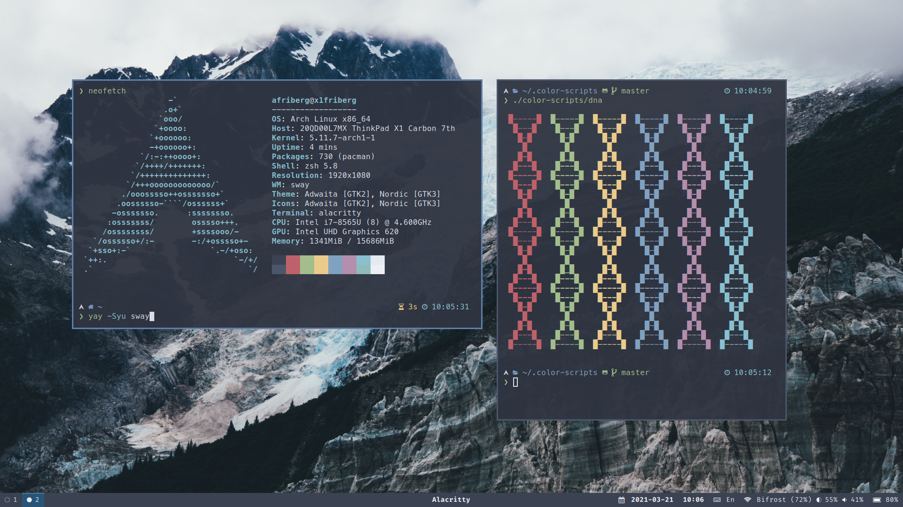
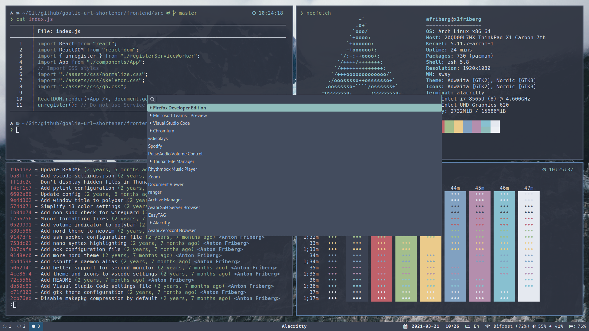
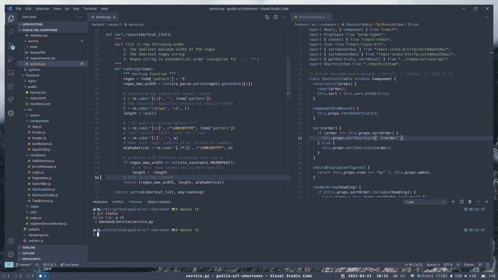

# AntonFriberg's Dotfiles

My personal dotfiles manging packages, scripts and configuration on [Ubuntu],
[Debian] and [Arch Linux]. Managed by [Home Manager] utilizing [Nix].

- Color Scheme: [Nord]
- Wallpaper: [Published on Unsplash]
- Terminal: [Alacritty]
- Editor: [Visual Studio Code]

[Ubuntu]: https://ubuntu.com/
[Debian]: https://www.debian.org/
[Arch Linux]: https://archlinux.org/
[Home Manager]: https://github.com/nix-community/home-manager
[Nix]: https://github.com/NixOS/nixpkgs
[Alacritty]: https://github.com/alacritty/alacritty
[Nord]: https://github.com/nordtheme/nord
[Visual Studio Code]: https://github.com/microsoft/vscode

## Screenshots
### Wallpaper
Wallpaper [published on Unsplash] which grants you an irrevocable, nonexclusive, worldwide copyright license to download, copy, modify, distribute, perform, and use images from Unsplash for free. See [Unsplash license] for more info.

[published on unsplash]: https://unsplash.com/photos/snow-covered-mountain-under-white-clouds-id_Rjz1bsoI
[unsplash license]: https://unsplash.com/license
### Clean

### Dirty

### Editor



## Installation & Management

### History

I originally used a simple solution to keep my dotfiles under version control
which I found on the [Atlassian developer blog]. This technique is great since according to comments requires:

> No extra tooling, no symlinks, files are tracked on a version control system,
  you can use different branches for different computers, you can replicate you configuration easily on new installation.

Later, I found [yadm], Yet Another Dotfiles Manager, which embraces
the same underlying idea but adds a user-friendly interface and tooling.

Currently, I am experimenting with a much more advanced setup using
[Home Manager] and [Nix] to not only manage my dotfiles but basically the entire
user environment. This means the package installation, fonts, window managers,
configurations, user services, and much more.

[atlassian developer blog]: https://developer.atlassian.com/blog/2016/02/best-way-to-store-dotfiles-git-bare-repo/
[yadm]: https://github.com/TheLocehiliosan/yadm

### Installation

Install Nix package manager using the [Determinate Nix Installer]

```sh
curl --proto '=https' --tlsv1.2 -sSf -L https://install.determinate.systems/nix | sh -s -- install
```

Make sure that it is working correctly.

```sh
$ nix run "nixpkgs#hello"
Hello, world!
```

Start a new Nix shell with two packages installed, `home-manager` and `git`.

```sh
nix shell "nixpkgs#home-manager" "nixpkgs#git"
```

Make sure that the dependencies gets installed correctly and are available.

```sh
$ home-manager --version
24.11-pre
$ git --version
git version 2.45.2
```

Clone this repository to user config path and apply.

```sh
git clone https://github.com/AntonFriberg/dotfiles.git ~/.config/home-manager
```
```sh
home-manager switch --flake ~/.config/home-manager
```

That is it. If the system and user is matching any available setup it will
install everything for you.

[Determinate Nix Installer]: https://determinate.systems/posts/determinate-nix-installer/

### Troubleshooting

No prompt in fish after initial startup? Run the following.

```fish
tide configure --auto --style=Lean --prompt_colors='True color' --show_time='24-hour format' --lean_prompt_height='Two lines' --prompt_connection=Disconnected --prompt_spacing=Compact --icons='Many icons' --transient=No
```

Unable to start Electron apps such as Chrome, Visual Studio Code, etc from Nix
on Ubuntu 24?

This is due security changes in AppArmor on Ubuntu 24. See https://github.com/NixOS/nixpkgs/issues/121694#issuecomment-2159420924

Current workaround is to disable the restriction. This can be done for the current
session with the following command.

```fish
echo 0 | sudo tee /proc/sys/kernel/apparmor_restrict_unprivileged_userns
```

Or perminently by editing the file `/etc/sysctl.d/60-apparmor-namespace.conf`

```conf
# Workaround for Electron apps from nixpkgs
kernel.apparmor_restrict_unprivileged_userns=0
```

## Python & Javascript Development

I prefer to keep Python and Javascript development environments outside of Nix
due to some issues I have experienced and known performance issues due to the
reproducible builds in Nix. Instead I install these via [Mise-en-Place] tool.

[Mise-en-Place] is installed using Nix as usual and configured in `modules/terminal/mise.nix`. Here I specify which tools I want access to globally.

```nix
{...}: {
  programs.mise = {
    enable = true;
    enableFishIntegration = true;
    globalConfig = {
      tools = {
        python = "3.12";
        node = "20";
      };
    };
  };
}
```

After activating my home-manager environment I have access to `mise` and can
run the following to install python and nodejs.

```sh
# Check that mise is installed
❯ mise --version
2024.5.9 linux-x64 (2024-08-12)
# Install configured global tools
❯ mise install
mise node@20.17.0 ✓ installed
mise python@3.12.5 ✓ installed
# Check that it is working
❯ python --version && which python
Python 3.12.5
/home/antonfr/.local/share/mise/installs/python/3.12/bin/python
❯ node --version && which node
v20.17.0
/home/antonfr/.local/share/mise/installs/node/20/bin/node
```

For local development where I might want different versions of Python or NodeJS
I utilize a project specific `.mise.toml` file.

```toml
[tools]
python = "3.10"

[env]
_.python.venv = { path = ".venv", create = true }
```

Then it works like this.

```sh
# Trust the .mise.toml file in the project dir
❯ mise trust project-dir/.mise.toml
# Navigate into the project dir which triggers mise hook
❯ cd project-dir/
mise missing: python@3.10.14
# Mise alerts that tools are missing from installation
❯ mise install
mise python@3.10.14 ✓ installed                                              mise creating venv at: ~/project-dir/.venv
# Mise installs Python version and activates our virtualenv
❯ python --version & which python & which pip
Python 3.10.14
/home/antonfr/project-dir/.venv/bin/python
/home/antonfr/project-dir/.venv/bin/pip
```

This means that I can quickly switch between different project specific tool
versions by simply navigating into them.

[Mise-en-Place]: https://mise.jdx.dev/
