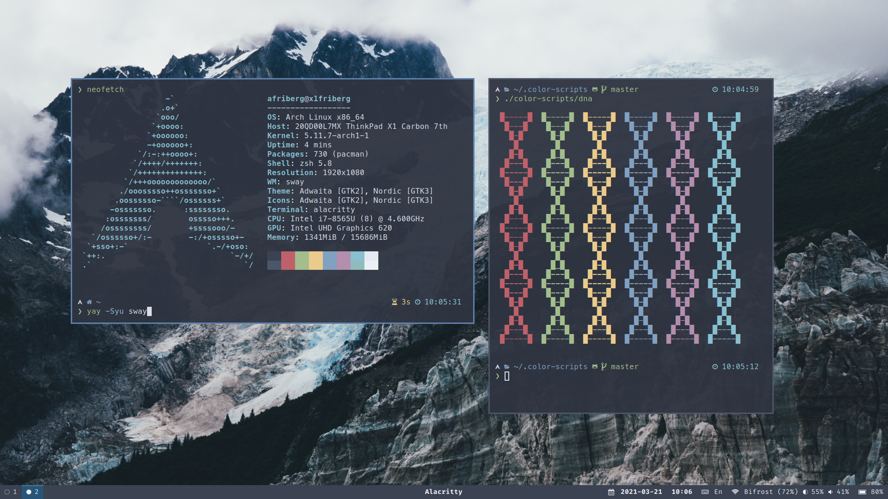
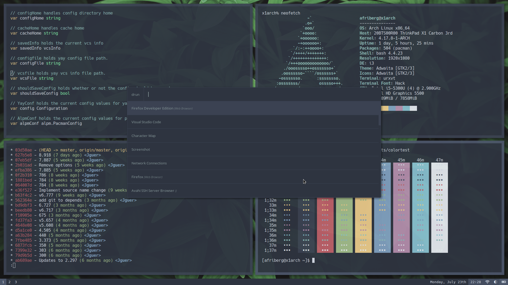
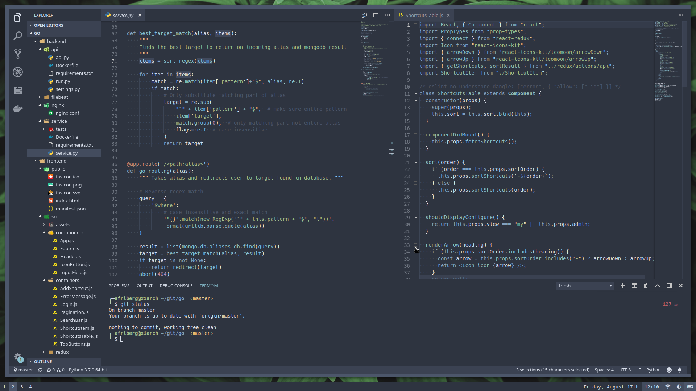

# AntonFriberg's Dotfiles

My personal dotfiles manging packages, scripts and configuration on [Ubuntu],
[Debian] and [Arch Linux]. Managed by [Home Manager] utilizing [Nix].

- Color Scheme: [Nord]
- Wallpaper: [Published on Unsplash]
- Terminal: [Alacritty]
- Editor: [Visual Studio Code]

[Ubuntu]: https://ubuntu.com/
[Debian]: https://www.debian.org/
[Arch Linux]: https://archlinux.org/
[Home Manager]: https://github.com/nix-community/home-manager
[Nix]: https://github.com/NixOS/nixpkgs
[Alacritty]: https://github.com/alacritty/alacritty
[Nord]: https://github.com/nordtheme/nord
[Visual Studio Code]: https://github.com/microsoft/vscode

## Screenshots
### Wallpaper
Wallpaper [published on Unsplash] which grants you an irrevocable, nonexclusive, worldwide copyright license to download, copy, modify, distribute, perform, and use images from Unsplash for free. See [Unsplash license] for more info.

[published on unsplash]: https://unsplash.com/photos/snow-covered-mountain-under-white-clouds-id_Rjz1bsoI
[unsplash license]: https://unsplash.com/license
### Clean

### Dirty

### Editor



## Installation & Management

### History

I originally used a simple solution to keep my dotfiles under version control
which I found on the [Atlassian developer blog]. This technique is great since according to comments requires:

> No extra tooling, no symlinks, files are tracked on a version control system,
  you can use different branches for different computers, you can replicate you configuration easily on new installation.

Later, I found [yadm], Yet Another Dotfiles Manager, which embraces
the same underlying idea but adds a user-friendly interface and tooling.

Currently, I am experimenting with a much more advanced setup using
[Home Manager] and [Nix] to not only manage my dotfiles but basically the entire
user environment. This means the package installation, fonts, window managers,
configurations, user services, and much more.

[atlassian developer blog]: https://developer.atlassian.com/blog/2016/02/best-way-to-store-dotfiles-git-bare-repo/
[yadm]: https://github.com/TheLocehiliosan/yadm

### Installation

Install Nix package manager using the [Determinate Nix Installer]

```sh
curl --proto '=https' --tlsv1.2 -sSf -L https://install.determinate.systems/nix | sh -s -- install
```

Make sure that it is working correctly.

```sh
$ nix run "nixpkgs#hello"
Hello, world!
```

Start a new Nix shell with two packages installed, `home-manager` and `git`.

```sh
nix shell "nixpkgs#home-manager" "nixpkgs#git"
```

Make sure that the dependencies gets installed correctly and are available.

```sh
$ home-manager --version
24.11-pre
$ git --version
git version 2.45.2
```

Clone this repository to user config path and apply.

```sh
git clone https://github.com/AntonFriberg/dotfiles.git ~/.config/home-manager
```
```sh
home-manager switch --flake ~/.config/home-manager
```

That is it. If the system and user is matching any available setup it will
install everything for you.
