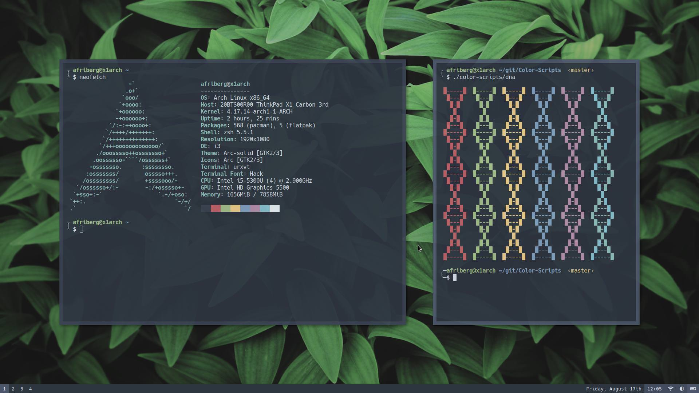

# AntonFriberg's Dotfiles

My personal configuration files and scripts used under both Arch Linux, Ubuntu
and Debian machines. Currently running [i3-gaps] window manager with [polybar],
[rofi] application launcher, [urxvt] terminal and [compton] as compositor

Based on the [nord colorscheme] and managed by [yadm].

[i3-gaps]: https://github.com/Airblader/i3
[polybar]: https://github.com/polybar/polybar
[rofi]: https://github.com/davatorium/rofi
[urxvt]: https://wiki.archlinux.org/index.php/Rxvt-unicode
[compton]: https://wiki.archlinux.org/index.php/Compton
[nord colorscheme]: https://github.com/arcticicestudio/nord
[yadm]: https://github.com/TheLocehiliosan/yadm

## Screenshots
### Clean

### Dirty

### Editor


## Dotfile Installation & Management

### History

I previously used a simple solution to keep my dotfiles under version control
which I found on the [Atlassian developer blog]. This technique is great since according to comments requires:

> No extra tooling, no symlinks, files are tracked on a version control system,
  you can use different branches for different computers, you can replicate you configuration easily on new installation.

However, recently I found [yadm], Yet Another Dotfiles Manager, which embraces
the same underlying idea but adds a user-friendly interface.

[atlassian developer blog]: https://developer.atlassian.com/blog/2016/02/best-way-to-store-dotfiles-git-bare-repo/

### Installation
Add your newly installed computer's public [ssh key to Github].

[ssh key to Github]: https://help.github.com/en/github/authenticating-to-github/adding-a-new-ssh-key-to-your-github-account

#### Arch Linux

```zsh
yay -Syu yadm-git
```

#### Ubuntu & Debian

```zsh
sudo apt update -y && sudo apt install -y git yad
```

#### Initialize

```zsh
yadm clone git@github.com:AntonFriberg/dotfiles.git
yadm decrypt
```

### Dotfile Management

```zsh
# Display yadm’s manual.
man yadm
# Show the repository status
yadm status
# Add file to dotfile management
yadm add .Xresources
# Commit change
yadm commit -m "Add Xresources"
# Send commits to remote repository
yadm push
```
