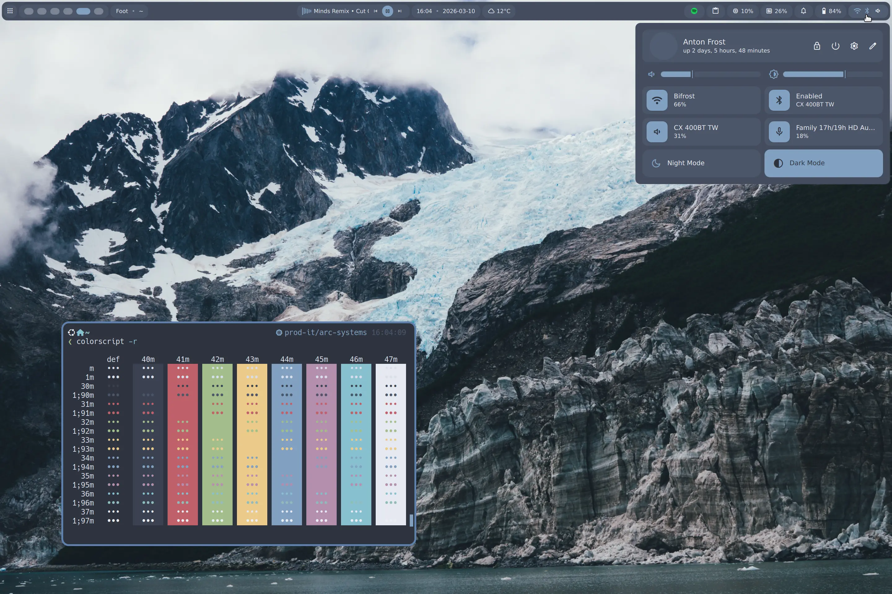
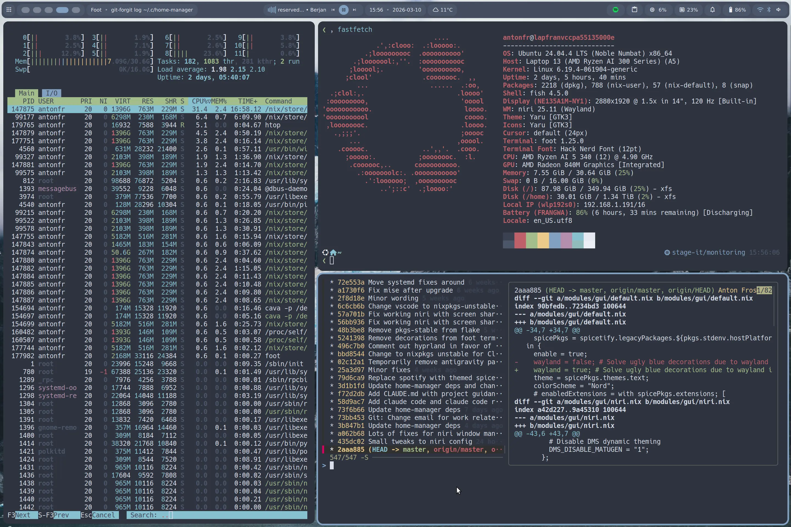
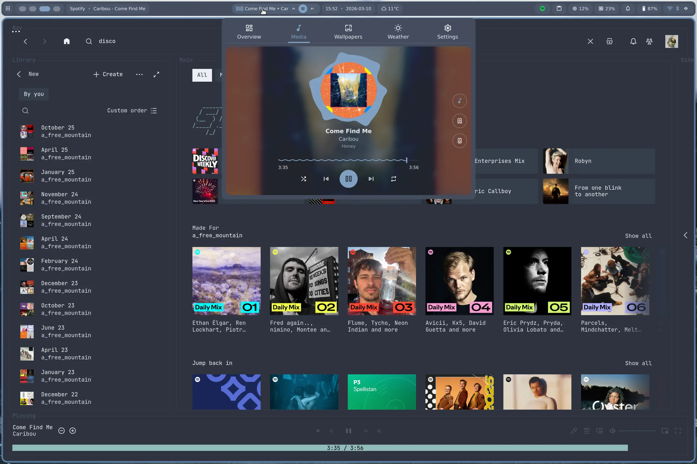
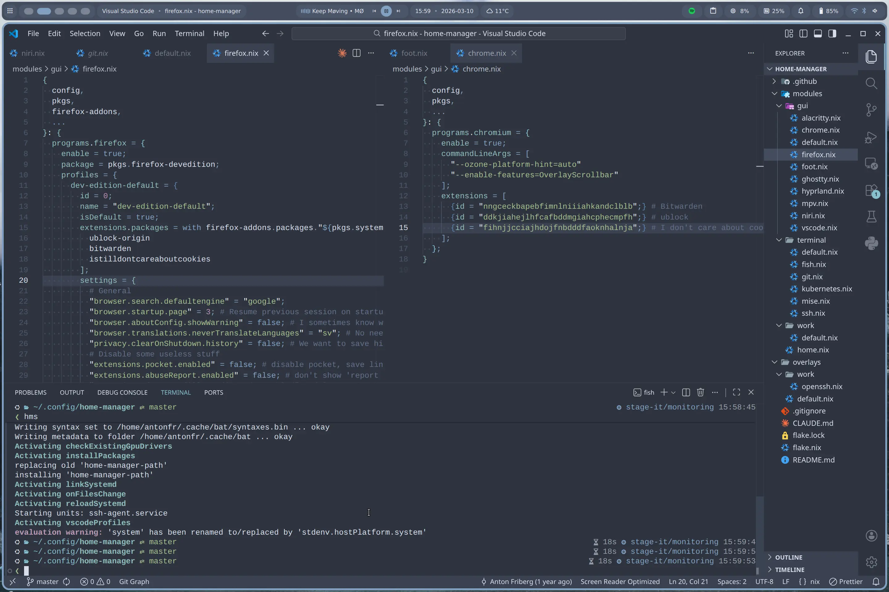

# AntonFriberg's Dotfiles

My personal dotfiles manging packages, scripts and configuration on [Ubuntu],
[Debian] and [Arch Linux]. Managed by [Home Manager] utilizing [Nix].

- Color Scheme: [Nord]
- Wallpaper: [Published on Wikimedia]
- Terminal: [Foot]
- Editor: [Visual Studio Code]
- Window Manager: [Niri]
- Spotify Client: [Spicetify]

[Ubuntu]: https://ubuntu.com/
[Debian]: https://www.debian.org/
[Arch Linux]: https://archlinux.org/
[Home Manager]: https://github.com/nix-community/home-manager
[Nix]: https://github.com/NixOS/nixpkgs
[Foot]: https://codeberg.org/dnkl/foot
[Nord]: https://github.com/nordtheme/nord
[Visual Studio Code]: https://github.com/microsoft/vscode
[Niri]: https://github.com/niri-wm/niri
[Spicetify]: https://spicetify.app/

## Screenshots

### Simple


### Busy


### Spotify


### VS Code



### Wallpaper
Wallpaper [published on Wikimedia] see [direct link to wallpaper].

[published on Wikimedia]: https://commons.wikimedia.org/wiki/File:Icy_glacier_slope_in_Kenai_Fjords_National_Park_%28Unsplash%29.jpg
[direct link to wallpaper]: https://upload.wikimedia.org/wikipedia/commons/e/ef/Icy_glacier_slope_in_Kenai_Fjords_National_Park_%28Unsplash%29.jpg

## Installation & Management

### History

I originally used a simple solution to keep my dotfiles under version control
which I found on the [Atlassian developer blog]. This technique is great since according to comments requires:

> No extra tooling, no symlinks, files are tracked on a version control system,
  you can use different branches for different computers, you can replicate you configuration easily on new installation.

Later, I found [yadm], Yet Another Dotfiles Manager, which embraces
the same underlying idea but adds a user-friendly interface and tooling.

Currently, I am experimenting with a much more advanced setup using
[Home Manager] and [Nix] to not only manage my dotfiles but basically the entire
user environment. This means the package installation, fonts, window managers,
configurations, user services, and much more.

[atlassian developer blog]: https://developer.atlassian.com/blog/2016/02/best-way-to-store-dotfiles-git-bare-repo/
[yadm]: https://github.com/TheLocehiliosan/yadm

### Installation

Install Nix package manager using the [Determinate Nix Installer]

```sh
curl -L https://install.determinate.systems/nix | sh -s -- install
```

Install Home-Manager and swith to this repos configuration.

```sh
$ nix run "nixpkgs#home-manager" -- switch --flake github:antonfriberg/dotfiles
```

That is it. If the system and user is matching any available setup it will
install everything for you.

[Determinate Nix Installer]: https://determinate.systems/posts/determinate-nix-installer/

### Troubleshooting

- **No prompt in fish after initial startup? Run the following.**

  ```fish
  tide configure --auto --style=Lean --prompt_colors='16 colors' --show_time='24-hour format' --lean_prompt_height='Two lines' --prompt_connection=Disconnected --prompt_spacing=Compact --icons='Many icons' --transient=No
  ```

- **Unable to start Nix applications due to errors such as `user: unknown userid 11789`**

  This happened on work computers after they were omborded with Red Hat IdM. I found two possible
  solutions.

  1. Specify path to shared library for libnss for nix program
      ```sh
      $ LD_PRELOAD="/lib/x86_64-linux-gnu/libnss_sss.so.2" <nix program>
      ```
  2. Install Name Service Cache Daemon (nscd)
      ```sh
      # For Debian/Ubuntu
      $ sudo apt install nscd
      ```

- **Unable to start Electron apps such as Chrome, Visual Studio Code, etc from Nix
  on Ubuntu 24 due to sandbox errors?**

  This is due security changes in AppArmor on Ubuntu 24.
  See https://github.com/NixOS/nixpkgs/issues/121694#issuecomment-2159420924

  Current workaround is to disable the restriction. This can be done for the current
  session with the following command.

  ```fish
  echo 0 | sudo tee /proc/sys/kernel/apparmor_restrict_unprivileged_userns
  ```

  Or perminently by editing the file `/etc/sysctl.d/60-apparmor-namespace.conf`

  ```conf
  # Workaround for Electron apps from nixpkgs
  kernel.apparmor_restrict_unprivileged_userns=0
  ```

- **Different cursor or blurry rendering in Electron apps?**

  This is due to apps running in XWayland instead of native Wayland rendering.
  Starting the application with extra command arguments forces native wayland.

  ```
  --enable-features=UseOzonePlatform
  --enable-features=WaylandWindowDecoration
  --ozone-platform=wayland
  ```

## Uninstall

This is one of best features of Nix and it extends to Home-Manager as well. To
uninstall we basically only need to do

```bash
$ sudo rm -rf /nix
```

That is it.

However, there will be some stuff left over such as groups, temporary files,
shell profile configurations, and other minor stuff. A better way to uninstall
Nix is to use the Determinate Installer that I recommend you use to install
Nix.

```bash
$ /nix/nix-installer uninstall
Nix uninstall plan (v0.27.0)

Planner: linux

Configured settings:
* nix_build_group_id: 30001

Planned actions:
* Remove upstream Nix daemon service
* Remove the directory `/etc/tmpfiles.d` if no other contents exists
* Unconfigure the shell profiles
* Remove the Nix configuration in `/etc/nix/nix.conf`
* Unset the default Nix profile
* Remove Nix users and group
* Remove the directory tree in `/nix`
* Remove the directory `/nix`


Proceed? ([Y]es/[n]o/[e]xplain):
```

This removes everything **properly**, including all files created in home
catalog by Home Manager! Full cleanup of your configurations and the
applications themselves in a single command!

This works due to how Nix works which Home-Manager utilizes.

Home-Manager does not place any configuration files in your home catalog.
Instead, it creates symlinks which reference generated files on a path unique
to the current iteration of inputs. So if any dependency or configuration
changes the generated files will be placed under a new directory. This makes
it really easy to revert a change by going back to the previous
generation, as seen the [Rollbacks section of the documentation].

So if we look at a generated configuration file.

```bash
$ ls -al
lrwxrwxrwx 1 antonfr antonfr 81 Oct 28 21:40 /home/antonfr/.config/git/config -> /nix/store/x3r12ppqhjgzdv2jx63cjflfc10qjn5b-home-manager-files/.config/git/config
```

We see that the contents are actually under /nix so once /nix is removed with
the uninstaller it also removes all references to /nix. Removing everything
neatly and without issues.

It does not remove local state, cache or temporary files which are unique for
each application and version. This is left up to the user. But this fact
also allows us to do something pretty nifty.

```
# Uninstall everything
$ /nix/nix-installer uninstall
# Reinstall Nix
$ curl -L https://install.determinate.systems/nix | sh -s -- install
# Recreate the entire setup back again
$ nix run "nixpkgs#home-manager" -- switch --flake github:antonfriberg/dotfiles
```

The above makes it pretty fool-proof if you ever manage to break Nix or
Home-Manager setup in any way. Simply tear everything down and recreate it.

[Rollbacks section of the documentation]:https://nix-community.github.io/home-manager/index.xhtml#sec-usage-rollbacks
